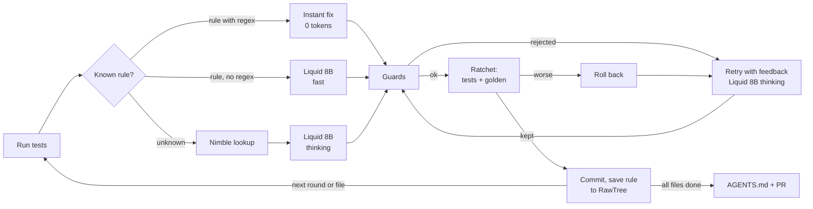

# Evergreen

Evergreen upgrades a codebase one file at a time and turns every fix it can prove into a rule in the repo's `AGENTS.md`.

## Links

- Live dashboard: https://evergreen-lhah.vercel.app
- Agent code (this repo): https://github.com/dhanraj176/Evergreen_Agent
- Dashboard code: https://github.com/Nakul-Shivaraj/Evergreen-LHAH
- Demo target repo: https://github.com/dhanraj176/sales-report
- Pull request opened by Evergreen (run test3, 3 to 21/21 tests): https://github.com/dhanraj176/sales-report/pull/3
- Demo video: VIDEO_URL

## 1. What Evergreen is

Coding agents start every session knowing nothing about your codebase. Teams patch this with hand-written rules files (`AGENTS.md`, `CLAUDE.md`, Cursor rules), but those files go stale: lessons from today's session never get written down, and when a library changes, old rules quietly become wrong. Meanwhile the library upgrade itself keeps getting postponed, because it's dozens of small, repetitive fixes.

Evergreen does the upgrade and keeps the rules file true while it works. It fixes one file at a time and keeps a fix only if the tests prove it didn't break anything (we call this the ratchet). Every kept fix becomes a rule with a confidence score, the library version it was proven on, and the web page it came from. Later files reuse those rules, often with no model call at all. At the end Evergreen writes the verified rules into `AGENTS.md` and opens a pull request for a human to review.

The demo target is [sales-report](https://github.com/dhanraj176/sales-report), a small pandas pipeline. Its pandas dependency has been bumped from 1.5 to 2.2, which leaves 18 of its 21 tests failing.

## 2. How it works

For each source file, in a fixed order:

1. **Test.** Run the full test suite (`pytest --junitxml`) and read which tests fail, where (the last traceback line inside `src/`), and why. Each failure gets a short signature such as `AttributeError: DataFrame.append`, the same in every file.
2. **Match a rule.** If a rule with the same signature exists, use it. Otherwise a small local model (Liquid LFM2.5-1.2B) picks the closest known rule, or answers "unknown". Two deterministic checks can veto its pick: the exception type and the API name must fit.
3. **Look it up.** For an unknown error, Nimble searches the live web (pandas.pydata.org first, then the open web) and returns a ~500-character snippet plus its URL.
4. **Patch** with the local Liquid LFM2.5-8B model, which returns JSON line edits for that one file. There are three modes:
   - **instant:** a known rule with a validated regex is applied to the exact line the traceback points at. No model call, 0 tokens. This is always tried first, on its own.
   - **fast:** every remaining failure has a known rule, and this isn't a retry. The model answers without reasoning first (about 10 s).
   - **thinking:** there's a new error, or an earlier attempt was rejected. The model reasons first (40–120 s).
5. **Guards.** The patch must parse. It must not delete a function or class, add `try/except`, `pytest.skip` or `xfail`, or rewrite too much of the file. A patch that fails a guard is never run.
6. **Ratchet.** Write the file and run the full suite plus the golden check. The golden check compares every function's output on sample data with what pandas 1.5 produced. The patch is kept only if all of these hold:
   - the test files are unchanged;
   - every test that passed before still passes;
   - at least one more test passes;
   - no golden case that matched stops matching;
   - no golden case gives wrong output.

   A case that still errors because another breakage in the same function isn't fixed yet is fine; the next round handles it. If the patch fails the ratchet, the file is rolled back. The next attempt is told what the patch changed and which tests still fail. Each round gets up to three model attempts; after that the file is marked "needs a human".
7. **Save.** A kept patch is committed on the branch `evergreen/pandas-2`. Each fix becomes a rule, and every attempt, match, lookup, test count and rule event is logged to RawTree.
8. **Finish.** Write the verified rules into the `AGENTS.md` block, commit, push the branch and open the PR.



Each model call sees only the current file, its failures and one rule or snippet per failure, so the prompt stays the same size from the first file to the last. The history lives in RawTree, not in the prompt.

## 3. Sponsor tools and where they live

| Tool | What it does in Evergreen | Code |
|---|---|---|
| **Liquid** | [LFM2.5-1.2B-Instruct](https://huggingface.co/LiquidAI/LFM2.5-1.2B-Instruct-GGUF) matches each failure to a known rule, with the answer limited by a grammar to the current rule IDs or "unknown". [LFM2.5-8B-A1B](https://huggingface.co/LiquidAI/LFM2.5-8B-A1B-GGUF) writes every patch, with its output forced into the edit JSON by a JSON-schema constraint. Both run on the laptop through llama-server from [llama.cpp](https://github.com/ggml-org/llama.cpp); no code leaves the machine. | `evergreen/liquid.py` (1.2B matcher), `evergreen/patcher.py` (8B patcher) |
| **Nimble** | Live web search ([Nimble Search API](https://docs.nimbleway.com/nimble-sdk/search-api)) for errors Evergreen hasn't seen before. A rule may cite only a URL that Nimble actually returned during the run; otherwise it's marked "unsourced". | `evergreen/evidence.py` |
| **RawTree** | The agent's memory, in [RawTree](https://rawtree.com/docs): every attempt, rule event, test count and lookup, as append-only rows over its HTTP API. Rows are also mirrored to `runs/<run_id>.jsonl`, and queries fall back to that file if RawTree can't be reached. | `evergreen/memory.py` |

`LLM_PROVIDER` can also be set to `openai` or `anthropic` (with `LLM_MODEL` and a key) to use a cloud model for patches instead. The default is the local Liquid model.

## 4. Setup (Windows and macOS)

**Tools:** git, the GitHub CLI, uv and [llama.cpp](https://github.com/ggml-org/llama.cpp) (which provides `llama-server`).

```powershell
# Windows (PowerShell)
winget install --id Git.Git -e
winget install --id GitHub.cli -e
winget install --id astral-sh.uv -e
winget install --id ggml.llamacpp -e
```

```bash
# macOS
brew install git gh uv llama.cpp
```

Then run `gh auth login` once. The PR step pushes to the demo repo, so you need push access to it (fork it if you don't have access).

**Clone the two repos side by side**, so that `sales-report` sits next to the Evergreen folder:

```bash
git clone https://github.com/dhanraj176/Evergreen_Agent.git Evergreen
git clone https://github.com/dhanraj176/sales-report.git
```

**Three virtual environments**, all on Python 3.11 (uv downloads it if needed):

```bash
# Evergreen itself
cd Evergreen
uv venv --python 3.11 .venv
uv pip install --python .venv -r requirements.txt

# sales-report: the old (pandas 1.5, all green) and new (pandas 2.2, mostly red) environments
cd ../sales-report
uv venv --python 3.11 .venv-old
uv pip install --python .venv-old "pandas==1.5.3" "numpy<2" pytest
uv venv --python 3.11 .venv-new
uv pip install --python .venv-new -r requirements.txt
```

To check them, run `.venv-old\Scripts\python.exe -m pytest -q` on Windows or `.venv-old/bin/python -m pytest -q` on macOS: it should pass 21/21. The same command with `.venv-new` should show 18 failures. The golden outputs, `golden/golden.json`, are already recorded on pandas 1.5.

**Keys:** copy `.env.example` to `.env` inside the Evergreen folder (`Copy-Item .env.example .env` on Windows, `cp .env.example .env` on macOS) and fill it in:

| Variable | Value |
|---|---|
| `LLM_PROVIDER` | `liquid` (default) |
| `PATCH_SERVER_URL` | `http://127.0.0.1:8081` (the 8B patch model) |
| `LLAMA_SERVER_URL` | `http://127.0.0.1:8080` (the 1.2B matcher) |
| `NIMBLE_API_KEY` | your key for the [Nimble Search API](https://docs.nimbleway.com/nimble-sdk/search-api) |
| `RAWTREE_API_KEY`, `RAWTREE_DATABASE` | your [RawTree](https://rawtree.com/docs) key (`read_write`) and database name, e.g. `evergreen` |
| `OPENAI_API_KEY`, `ANTHROPIC_API_KEY`, `LLM_MODEL` | only if `LLM_PROVIDER` is `openai` or `anthropic` |

`.env` is in `.gitignore`. Never commit it or paste keys anywhere else. Use `127.0.0.1` rather than `localhost`: on Windows, `localhost` tries IPv6 first and adds about 2 s to every request.

**Start the two Liquid models**, each in its own terminal and left running: [LFM2.5-1.2B-Instruct GGUF](https://huggingface.co/LiquidAI/LFM2.5-1.2B-Instruct-GGUF) on port 8080 for rule matching, and [LFM2.5-8B-A1B GGUF](https://huggingface.co/LiquidAI/LFM2.5-8B-A1B-GGUF) on port 8081 for patches. The first start downloads them from Hugging Face.

```bash
llama-server -hf LiquidAI/LFM2.5-1.2B-Instruct-GGUF:Q4_K_M --host 127.0.0.1 --port 8080 -c 8192
llama-server -hf LiquidAI/LFM2.5-8B-A1B-GGUF --host 127.0.0.1 --port 8081 -c 8192
```

`http://127.0.0.1:8080/health` and `http://127.0.0.1:8081/health` should both answer `{"status":"ok"}`.

## 5. Run and reset

From the Evergreen folder (the same commands work in PowerShell and on macOS):

```bash
uv run python run.py --repo ../sales-report --venv ../sales-report/.venv-new --run-id demo1
```

This checks that `sales-report` has no uncommitted changes and creates the branch `evergreen/pandas-2`. It then fixes the files one by one, committing each kept patch. At the end it commits the `AGENTS.md` block, pushes the branch, opens the PR, writes `runs/demo1/summary.json`, and prints a summary table with seconds per file and the mode of every attempt. Expect about 12–16 minutes on a laptop (r2: 12, test3: 16); most of that is the 8B model thinking.

- `--no-pr` commits locally but doesn't push or open a PR.
- `--no-rules` is the ablation run: every error is treated as new, so each file looks its errors up again and no rule is reused.
- `--memory-from <run_id>`: warm start (below).

**Warm start.** `--memory-from <run_id>` begins the run with that run's final rulebook: the latest event of every rule that ended verified or trusted, read from RawTree (or from `runs/<run_id>/` if RawTree can't be reached). Demoted and retired rules are left out. The loaded rules start as trusted and keep their regexes. Each one is logged as a `loaded` rule event naming the source run, and the header shows `memory: N rules from <run_id>`. Known errors then skip the web lookup: they're fixed instantly by regex, or in fast mode when the regex doesn't fit the line. Only errors no rule covers go to Nimble and a thinking patch. Every guard, the ratchet and the golden check still apply.

```bash
uv run python run.py --repo ../sales-report --venv ../sales-report/.venv-new --run-id live2 --memory-from live1
```

Starting from live1's rules, live2 took 266 s instead of about 9 minutes (see Results).

To rehearse again:

```bash
uv run python reset.py
```

This closes the open Evergreen PR, deletes `evergreen/pandas-2` on GitHub and locally, discards any uncommitted changes a crashed run left behind, and checks out `main`, which is the red state. Pass `--repo` if `sales-report` isn't next to the Evergreen folder.

## 6. Reading the live screen

**Header:** the repo, run id, mode (rules on or off) and elapsed time. The big number is tests passing out of the total. It's red while anything fails and turns green when everything passes.

**Counters:**

- **rules learned:** new rules, each born from a patch the ratchet kept.
- **rules applied:** times a known rule was matched to a failure and used.
- **instant fixes (0 tokens):** lines fixed by a rule's regex with no model call, counted when the ratchet kept them.
- **web lookups:** Nimble searches.
- **rollbacks:** patches that ran but made things worse, so the file was restored.
- **patches rejected by guard:** patches refused before they ran.
- **human interventions:** stays 0. Nobody touches the keyboard during a run.
- **prompt tokens now (naive N):** the size of the latest prompt, next to what a chat-style agent would be sending by now if it carried every earlier prompt and answer in its context.

**Files panel:** one line per file:

- **status:** `·` waiting, `▶` working (with the attempt number), `✓` fixed, `✗` needs a human;
- **mode** of the current or last attempt: *instant*, *fast* or *thinking*;
- **seconds** spent on the file;
- **rules** applied or learned there.

A **round** is up to three model attempts at getting one patch kept for the file's current failures. When instant rules apply, the round starts with an instant-only attempt. If a kept patch leaves failures behind, the next round works on those. Each attempt ends one of three ways:

- **accepted:** committed.
- **rolled back:** the tests or golden outputs got worse, so the file was restored.
- **guard rejected:** refused before running, for example because it doesn't parse or deletes a function.

**Log colours:**

| Colour | Meaning |
|---|---|
| cyan `NIMBLE` | a web lookup, with the URL it returned |
| green `LEARNED` | a new rule, with its signature and source (or "unsourced") |
| magenta `RULE` | a known rule matched to a failure (exact match or Liquid) |
| bright green `INSTANT` | a rule applied by regex, 0 tokens |
| bold | the file being started and its failing signatures |
| green | a patch kept and committed |
| yellow | a guard rejection, rollback, demotion, or a lookup with no result |
| red | needs a human, or a model call that failed |

The final panel shows the PR link, or the reason it couldn't open one.

## 7. Results

All numbers come from real runs on this laptop (Windows 11, both models on llama-server) with the same 21 tests. r1 to test3 ran against `sales-report`; live1 and live2 ran against a separate copy of it (`sales-report-demo`).

| Run | Code | Tests | Time | Notes |
|---|---|---|---|---|
| r1 | first full loop | 3/21 → 15/21 | 773 s | export.py and summary.py needed a human |
| r2 | + 4096-token thinking budget, instant rules | 3/21 → 18/21 | 733 s | export.py needed a human; PR opened with the AGENTS.md block |
| test3 | + instant-first, partial progress, retry feedback | 3/21 → **21/21** | 977 s | no file needed a human; 9 fix commits, then AGENTS.md and the PR |
| live1 | same loop, from scratch | 3/21 → **21/21** | 529 s (about 9 min) | 11 Nimble lookups, 6 rules learned, 0 human interventions |
| live2 | warm start: `--memory-from live1` | 3/21 → **21/21** | 266 s | 2 Nimble lookups, 9 instant fixes, 1 new rule, 0 human interventions |

**test3, file by file** (from `runs/test3/summary.json`):

| File | Result | Attempts | Seconds | Web lookups | Rules |
|---|---|---|---|---|---|
| clean.py | fixed | thinking: kept | 52 | 2 | learned R1, R2 |
| metrics.py | fixed | thinking: kept | 51 | 1 | learned R3 |
| report.py | fixed | instant: kept · fast: kept | 12 | 0 | reused R2 (instant) and R1 |
| export.py | fixed | instant: kept · thinking: guard, guard, kept | 202 | 2 | reused R2 (instant) |
| summary.py | fixed | instant: kept · fast: rolled back · thinking: rolled back, kept | 210 | 1 | reused R3 (instant) and R1; learned R4 |
| index_utils.py | fixed | thinking: guard, guard, kept | 450 | 2 | learned R5, R6 |

- **Rules reused.** The first two files cost web lookups and thinking-mode patches. report.py, the first file that needed only known rules, took 12 s with no web lookup: R2 was applied by regex, then R1 in fast mode.
- **Instant fixes.** There were three (report.py, export.py and summary.py), each kept by the ratchet, 3–5 s each, with 0 tokens.
- **Rule scores.** Six rules were learned, all with a Nimble source. R2 (iteritems, confidence 0.80) and R3 (mean, 0.75) became trusted. R1 (append) was demoted after failing twice in summary.py, and the fix learned there became R4.
- **Flat prompt.** Evergreen's prompt stayed between 459 and 1,026 tokens per model call. By the last attempt, a chat-style agent carrying its whole history would have been sending **26,750** tokens; Evergreen sent **906**.
- **Human interventions:** 0.

**live2, file by file** (warm start from live1, from `runs/live2/summary.json`):

| File | Result | Attempts | Seconds | Web lookups | Rules |
|---|---|---|---|---|---|
| clean.py | fixed | instant: kept · fast: kept | 16 | 0 | R1 (instant), R3 (fast) |
| metrics.py | fixed | instant: kept | 5 | 0 | R2 (instant) |
| report.py | fixed | instant: kept | 5 | 0 | R1, R3 (instant) |
| export.py | fixed | instant: kept | 4 | 0 | R1, R4 (instant) |
| summary.py | fixed | instant: kept · fast: kept | 11 | 0 | R2 (instant), R3 (fast) |
| index_utils.py | fixed | instant: kept · thinking: rolled back, kept | 217 | 2 | R5 (instant); learned R7 |

- **Loaded rules did the work.** The first five files took 41 s together, with no web lookup. That's 9 lines fixed by regex at 0 tokens, plus two fast model calls for `append`, where the regex was tied to one file's variable names.
- **One uncovered error cost most of the time.** live1 had learned its `Int64Index` fix under an intermediate error, `pandas.NumericIndex`, so the original error had no rule. index_utils.py needed 2 Nimble lookups and two thinking attempts: 217 s of the 266. live2 learned that fix under the original signature, as R7. A run with `--memory-from live2` should skip it too, but we haven't measured that yet.
- **Where the time went** (`timing` in the summary): 209 s in the model, almost all of it the two thinking attempts; 29 s pytest; 10 s golden check; 8 s baseline; 12 s everything else.
- **Flat prompt.** The last prompt was 645 tokens; a chat-style agent would have been sending 4,924.

**Why export.py needed a human in r1 and r2, and what we fixed.** The fix is to rename `to_csv(line_terminator=...)` to `lineterminator=`. Instead, the model often deleted the argument, in 2 of 3 samples when we re-ran the same prompt. On Windows that silently switches the CSV to CRLF line endings. The ratchet caught it every time: the golden output no longer matched, and the line-ending test kept failing. But Evergreen's retry message only said "golden mismatch", so the model repeated the same mistake. In r1, three thinking answers, one of them in export.py, were also cut off mid-JSON by a 2048-token limit. We fixed our side:

- the thinking budget is now 4096 tokens;
- retries are told exactly what the rejected patch changed and which tests still fail;
- known rules are applied instantly first and committed on their own, so the model only sees the remaining error;
- the ratchet keeps partial progress instead of demanding a whole file at once;
- the patcher keeps a replaced line's indentation, which the model often shifted.

In test3, export.py was fixed in two rounds. The iteritems rule applied instantly, then the model fixed `line_terminator` on its third attempt.

**What still goes wrong.** In test3 the guard refused four patches before they ran:

- twice in export.py, a mangled `"\n"` escape that no longer parsed;
- once in index_utils.py, a diff marker (`-`) pasted into the code;
- once in index_utils.py, a patch that deleted a function.

None of them reached the code, but these retries are most of the run time: index_utils.py alone took 7.5 minutes of thinking.

## 8. Safety and honest limits

- **Tests are read-only.** A hash of `tests/` and `golden/` is taken at the start, and any patch that changes them is rejected.
- **The guard** blocks the usual ways to cheat a test suite: deleting a function, adding `try/except`, `pytest.skip` or `xfail`, or rewriting most of the file.
- **Golden outputs** catch patches that make tests pass but change behaviour, such as the `\r\n` example above.
- **Rules are earned.** They are born only from kept patches, used only on the same error signature, scored by outcome, and demoted after two failures in a row.
- **A human reviews everything.** Evergreen never merges: it opens a PR with one commit per kept fix.

Evergreen can only verify what the tests and golden outputs cover; weak tests mean weaker guarantees, which is why the PR is there. A full run takes about 12–16 minutes on a laptop, mostly the 8B model thinking. The local model sometimes aims an edit at the wrong line or drops an argument. The guard and ratchet catch those, but they cost retries, and a file can still end up as "needs a human".

## 9. Project layout

```
run.py                   CLI: one run from red tests to an open PR
reset.py                 puts the demo repo back in its red state for another run
requirements.txt         agent dependencies
.env.example             settings and keys to copy into .env (never commit .env)
evergreen/schema.py      shared dataclasses: Failure, TestRun, Rule, Evidence, PatchResult
evergreen/loop.py        the ratchet loop: rounds, attempts, instant-first, rollback, rules, end of run
evergreen/testrun.py     runs pytest in the target venv and turns failures into signatures
evergreen/patcher.py     Liquid 8B line-edit patches (thinking or fast), rule and regex extraction
evergreen/guards.py      the patch guard and the tests/golden hash
evergreen/instant.py     applies a rule's regex to one line (0 tokens)
evergreen/golden.py      runs golden/golden.py check and applies the golden ratchet
evergreen/liquid.py      Liquid 1.2B rule matcher with a grammar, plus deterministic vetoes
evergreen/evidence.py    Nimble search and snippet
evergreen/memory.py      RawTree logging and queries, local JSONL mirror, rule cache, confidence
evergreen/agents_md.py   writes Evergreen's block in the target's AGENTS.md
evergreen/display.py     the live screen
evergreen/results.py     summary table, runs/<run_id>/summary.json, PR body
evergreen/gitops.py      snapshot/restore, commits, branch, push, PR
evergreen/changelog.py   release-notes fetch for rule expiry (not built yet)
bench/charts.py          results charts (not built yet)
runs/                    local logs and summaries (not committed)
```

Demo repo: https://github.com/dhanraj176/sales-report
